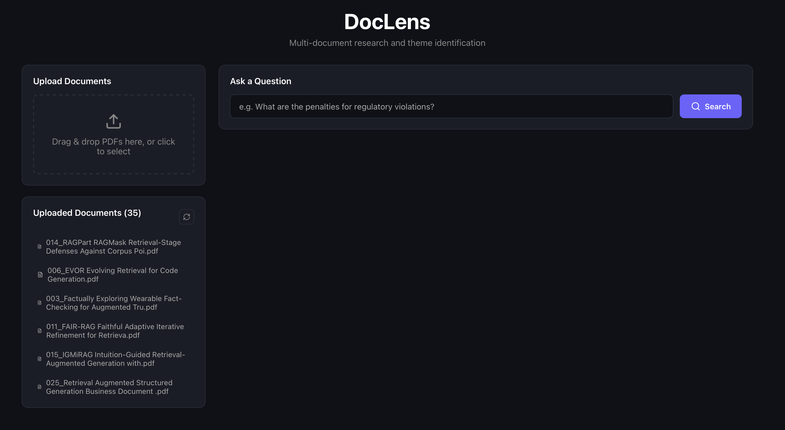
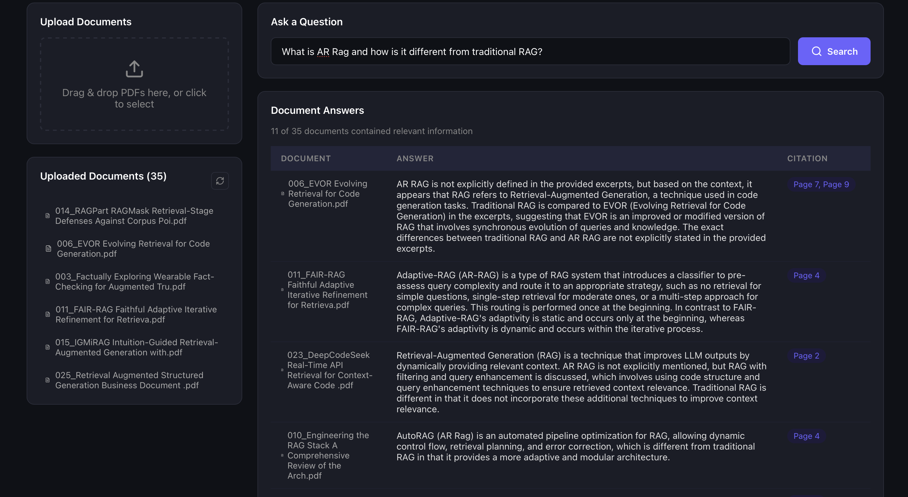
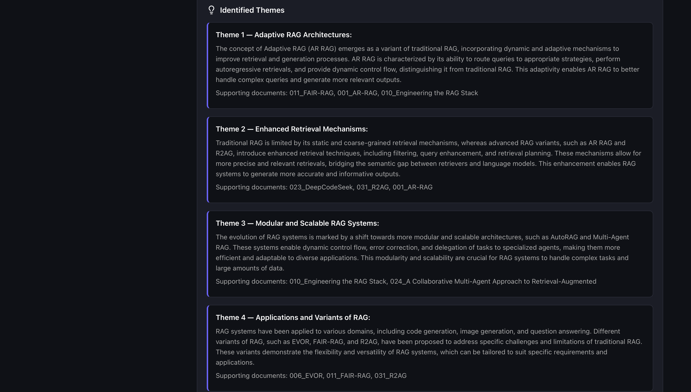

# DocLens

A full-stack AI system for multi-document analysis and cross-document theme extraction. Upload research papers or any PDFs, ask natural language questions, and get per-document answers with citations plus synthesized themes across your entire document set.

---

## Screenshots


*35 PDFs uploaded with page and chunk counts*


*Per-document answers with page-level citations*


*Cross-document theme synthesis*

---

## Architecture

```
┌─────────────────────────────────────────────────────┐
│                  React Frontend                      │
│  Upload → DocumentList → QueryBox → ResultsTable    │
│                          └──────→ ThemePanel         │
└────────────────────┬────────────────────────────────┘
                     │ HTTP (Axios)
                     ▼
┌─────────────────────────────────────────────────────┐
│               FastAPI Backend                        │
│  POST /api/upload    POST /api/query                 │
│         │                    │                       │
│   ┌─────▼──────┐      ┌──────▼──────┐               │
│   │ Ingestion  │      │   Query     │               │
│   │  Service   │      │   Service   │               │
│   └─────┬──────┘      └──────┬──────┘               │
└─────────┼────────────────────┼──────────────────────┘
          │                    │
    ┌─────▼──────┐      ┌──────▼──────────────┐
    │   Qdrant   │◄─────│  Vector Search       │
    │ (Vectors)  │      │  per document        │
    └────────────┘      └──────┬──────────────┘
                               │
              ┌────────────────┼────────────────┐
              ▼                ▼                ▼
      ┌──────────────┐ ┌────────────┐ ┌──────────────┐
      │Google Gemini │ │    Groq    │ │    Groq      │
      │  Embeddings  │ │ Per-doc    │ │  Theme       │
      │              │ │ Answers    │ │  Synthesis   │
      └──────────────┘ └────────────┘ └──────────────┘
```

### Pipeline

**Ingestion:**
PDF → Text Extraction (PyMuPDF + OCR fallback) → Chunking (500 words, 50 overlap) → Gemini Embeddings → Qdrant Storage

**Query:**
Query → Gemini Embedding → Vector Search per Document → Groq LLM per-doc Answer → Groq Theme Synthesis

---

## Tech Stack

| Layer | Technology |
|-------|-----------|
| Backend | FastAPI 0.135 + Uvicorn |
| Frontend | React 19 |
| Vector Database | Qdrant |
| Embeddings | Google Gemini (`gemini-embedding-001`, 3072 dims) |
| LLM | Groq (`llama-3.3-70b-versatile`) |
| PDF Processing | PyMuPDF + Pytesseract (OCR fallback) |
| Validation | Pydantic v2 |

---

## Features

- **Drag-and-drop PDF upload** with real-time ingestion feedback
- **Per-document RAG answers** with page-level citations
- **Cross-document theme synthesis** — identifies 2-4 common themes across all uploaded docs
- **OCR fallback** for scanned/image-based PDFs
- **Rate-limit retry logic** for Gemini embedding API

---

## Setup

### Prerequisites

- Python 3.11+
- Node.js 18+
- [Qdrant](https://qdrant.tech/documentation/quick-start/) running locally (or via Docker)
- Google Gemini API key
- Groq API key

### 1. Start Qdrant

```bash
docker run -p 6333:6333 qdrant/qdrant
```

### 2. Backend

```bash
cd backend
python -m venv venv
source venv/bin/activate        # Windows: venv\Scripts\activate
pip install -r requirements.txt

cp .env.example .env            # fill in your API keys
uvicorn app.main:app --reload
```

### 3. Frontend

```bash
cd frontend
npm install
npm start
```

Open [http://localhost:3000](http://localhost:3000).

---

## Environment Variables

Copy `backend/.env.example` to `backend/.env` and fill in:

```
GEMINI_API_KEY=your_google_gemini_api_key
GROQ_API_KEY=your_groq_api_key
QDRANT_HOST=localhost
QDRANT_PORT=6333
```

Get API keys:
- Gemini: [https://aistudio.google.com/app/apikey](https://aistudio.google.com/app/apikey)
- Groq: [https://console.groq.com/keys](https://console.groq.com/keys)

---

## API Reference

| Method | Endpoint | Description |
|--------|----------|-------------|
| `GET` | `/api/health` | Health check |
| `POST` | `/api/upload` | Upload a PDF for ingestion |
| `POST` | `/api/query` | Query all uploaded documents |
| `GET` | `/api/documents` | List all uploaded documents |

### Upload Response

```json
{
  "status": "success",
  "filename": "paper.pdf",
  "pages": 12,
  "chunks": 54
}
```

### Query Request / Response

```json
// POST /api/query
{ "query": "What evaluation metrics are used?" }

// Response
{
  "query": "What evaluation metrics are used?",
  "doc_answers": [
    {
      "filename": "paper1.pdf",
      "answer": "The paper uses ROUGE-L and BLEU scores...",
      "citation": "Page 5"
    }
  ],
  "themes": "THEME 1 - Retrieval Quality Metrics:\n..."
}
```

---

## Project Structure

```
doclens/
├── backend/
│   ├── app/
│   │   ├── main.py              # FastAPI app + CORS
│   │   ├── config.py            # Settings from environment
│   │   ├── api/
│   │   │   └── routes.py        # API endpoints
│   │   ├── core/
│   │   │   └── clients.py       # Shared API clients (Qdrant, Gemini, Groq)
│   │   ├── models/
│   │   │   └── schemas.py       # Pydantic request/response models
│   │   └── services/
│   │       ├── ingestion.py     # PDF processing pipeline
│   │       └── query.py         # RAG query pipeline
│   ├── data/papers/             # Sample research PDFs
│   ├── .env.example
│   └── requirements.txt
├── frontend/
│   └── src/
│       ├── App.js
│       └── components/
│           ├── Upload.js
│           ├── QueryBox.js
│           ├── ResultsTable.js
│           ├── ThemePanel.js
│           └── DocumentList.js
├── scripts/
│   └── download_papers.py       # ArXiv paper downloader
└── tests/
    ├── conftest.py
    ├── test_ingestion.py
    └── test_query.py
```

---

## Running Tests

```bash
cd backend
pip install pytest
pytest ../tests/ -v
```

---

## Sample Data

The `backend/data/papers/` directory contains 70+ research papers on Retrieval-Augmented Generation downloaded from ArXiv, useful for testing the system end-to-end.

To download more papers:

```bash
python scripts/download_papers.py
```
